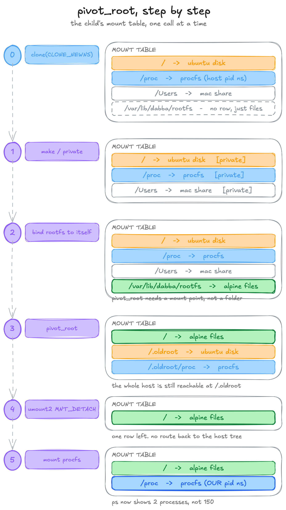
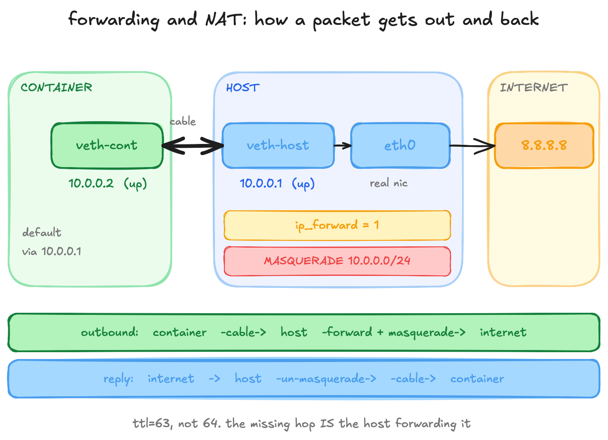
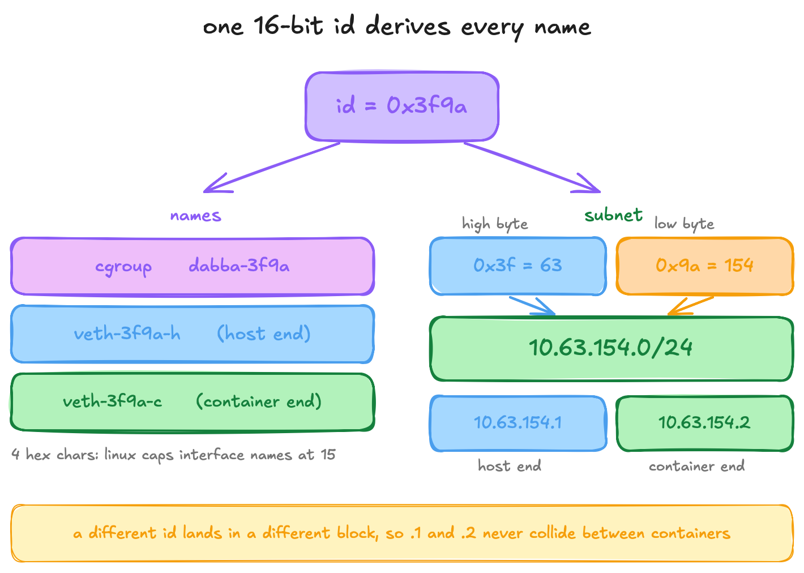

# dabba

*dabba (डब्बा) means "container" in Hindi.*

a container runtime written from scratch in c++20. no docker, no libraries doing the hard part, just raw linux syscalls.

a container is not magic. it is an ordinary linux process that has been lied to about the world it lives in. it is told it has its own process tree, its own filesystem, its own network, and a hard ceiling on the memory and cpu it can touch. dabba builds that lie, one syscall at a time.

```sh
sudo dabba run --memory 50M --cpu 20 --pids 20 --net /bin/sh
```

that one command gives you a process with its own hostname, its own pid namespace (it thinks it is pid 1), an alpine root filesystem, a network cable to the internet, and limits that will kill a fork bomb instead of your machine.

## what it does

```
dabba run [--memory N] [--cpu N] [--pids N] [--rootfs PATH] [--net] <cmd> [args...]
dabba ps                       # list running containers
dabba exec <id> <cmd>          # step into a running container
dabba kill <id>                # kill one
```

- **namespaces** so the container has its own pids, hostname, mounts, network and ipc
- **pivot_root** so `/` is an alpine userland, not your host
- **cgroups v2** so `--memory` OOM-kills inside the container, `--pids` stops a fork bomb, `--cpu` throttles a busy loop
- **veth + NAT** so `ping 8.8.8.8` works from inside
- **per-container ids** so you can run more than one at a time, each with its own everything

every one of those is a thing you can watch happen. the container renames its own hostname and your host is untouched. a fork bomb pins at 20 processes and your laptop does not even notice.

## the filesystem swap

`pivot_root` is the trick that turns a folder into `/`. a mount is just a row in a lookup table, and this is five edits to that table:



## networking

the container's network namespace starts empty. we run a virtual cable out of it, give both ends an address, and let the host NAT its traffic to the internet, exactly like your home router does for every device in your house:



## one id, every name

running two containers at once means nothing can be hardcoded. one 16-bit id derives the cgroup name, both veth names, and a unique subnet:



## running it

**this is linux only.** it needs namespaces, cgroups v2 and `pivot_root`, none of which exist on macos or windows. on a mac use a linux vm (i used [lima](https://lima-vm.io/)).

you need a c++20 compiler (gcc 12+ / clang 15+), cmake, and `iproute2` + `iptables` for the `--net` path.

```sh
# build
cmake -S . -B build
cmake --build build

# get an alpine rootfs (one time). match your arch (aarch64 or x86_64).
sudo mkdir -p /var/lib/dabba/rootfs
cd /var/lib/dabba
sudo curl -LO https://dl-cdn.alpinelinux.org/alpine/latest-stable/releases/aarch64/alpine-minirootfs-3.24.1-aarch64.tar.gz
sudo tar -xzf alpine-minirootfs-3.24.1-aarch64.tar.gz -C rootfs

# run
sudo ./build/dabba run --net /bin/sh
```

it needs `sudo` because creating namespaces needs `CAP_SYS_ADMIN`. dropping that with user namespaces is on the list below.

## what it does not do

this is a learning build, and it is honest about its edges:

- **no image pulling.** you extract one alpine tarball by hand. no registry, no `dabba pull`.
- **no layers.** the rootfs is one plain directory, so `apk add` in one run persists. no overlayfs.
- **not secure.** the container runs as real root on the host. no seccomp, no capability dropping, no user namespaces. do not run untrusted code in it.
- **networking is shelled out.** it calls `ip` and `iptables` instead of talking raw netlink.

## what is next

- user namespaces, so it stops needing `sudo`
- overlayfs, so runs stop mutating the base image
- an oci image puller, so `dabba pull alpine` works
- raw netlink instead of shelling out to `ip`

## the writeup

i built this to actually understand how containers work, and wrote the whole thing up: the anomalies i hit, why each fix is what it is, and what c++ taught me along the way. [link to the blog post].
